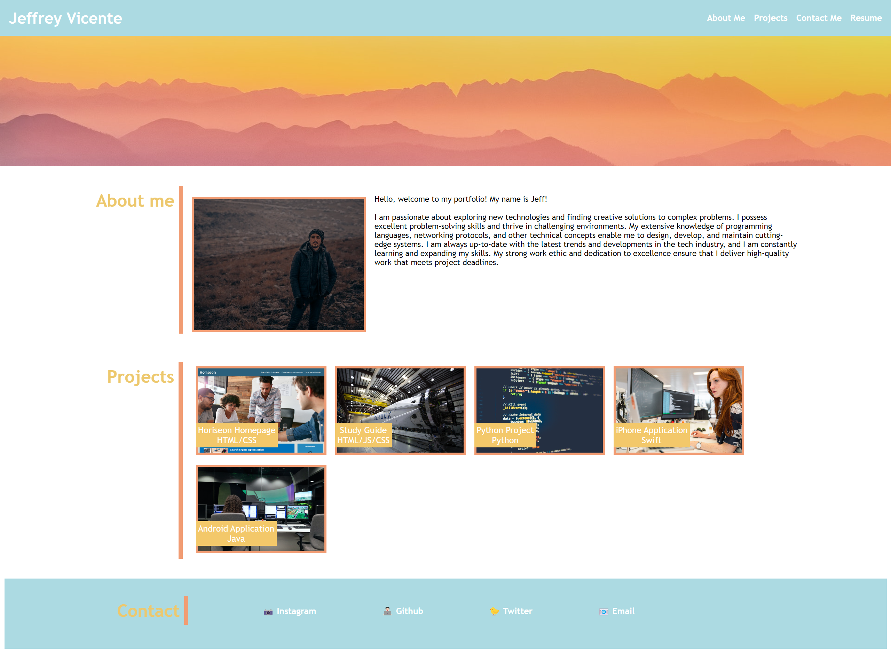
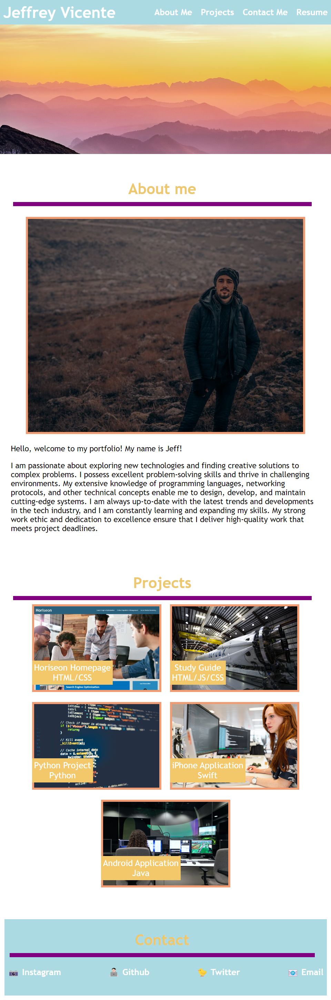
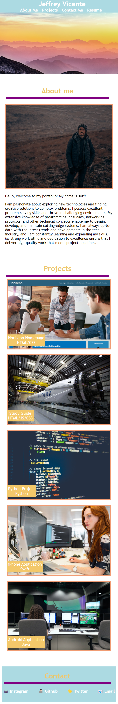
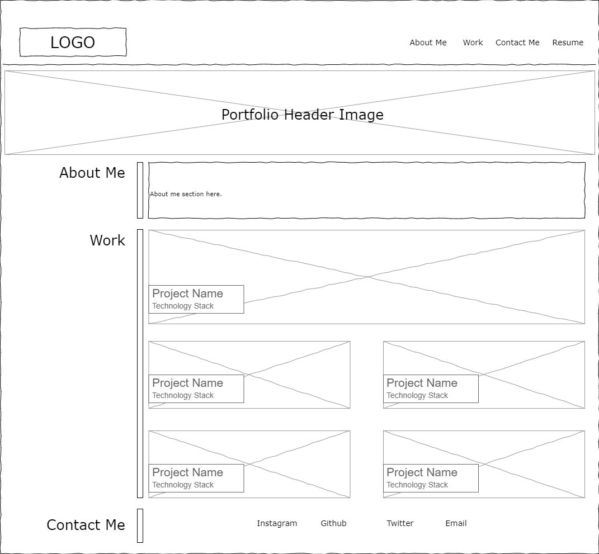

# Professional Work Portfolio

## Description

A portfolio of work can showcase your skills and talents to employers looking to fill a part-time or full-time position. An effective portfolio highlights your strongest work as well as the thought processes behind it. Students who have portfolios with deployed web applications are typically very successful in their career search after the boot camp. 

This project is to showcase what I have recently learned in class.

Page is reactive for phones when the max pixel width is at 580px.<br>
Page is reactive for tablets when the max pizel width is at 768px. 

## Table of Contents
- [Installation](#installation)
- [User Story](#user-story)
- [Acceptance Criteria](#acceptance-criteria)
- [Preview](#preview)
- [Features](#wireframe-concept)
- [Technology Used](#technologies-used)


## Installation

- Download or clone repository to your local machine. 
- Navigate to the to the file. 
- Open the index.html in your browser. 


## User Story
```
AS AN employer
I WANT to view a potential employee's deployed portfolio of work samples
SO THAT I can review samples of their work and assess whether they're a good candidate for an open position
```


## Acceptance Criteria 

```
GIVEN I need to sample a potential employee's previous work
WHEN I load their portfolio
THEN I am presented with the developer's name, a recent photo or avatar, and links to sections about them, their work, and how to contact them
WHEN I click one of the links in the navigation
THEN the UI scrolls to the corresponding section
WHEN I click on the link to the section about their work
THEN the UI scrolls to a section with titled images of the developer's applications
WHEN I am presented with the developer's first application
THEN that application's image should be larger in size than the others
WHEN I click on the images of the applications
THEN I am taken to that deployed application
WHEN I resize the page or view the site on various screens and devices
THEN I am presented with a responsive layout that adapts to my viewport
```
## Preview

View live preview hosted on [GitHub Pages](https://jeffreyvicente.github.io/02-ProfessionalWorkPortfolio/)
<br>
<p align="left">
     
    <br>
    Webpage screenshot viewed in browser
    <br>
    <br>
    <br>
    
    <br>
    Webpage screenshot viewed in tablet window
    <br>
    <br>
    <br>
    
    <br>
    Webpage screenshot viewed in phone window
</p>


## Wireframe Concept

<p align="left">
     
    <br>
    Orginal wireframe concept of the portfolio webpage
    
</p>

## Technology Used
- HTML
- CSS


